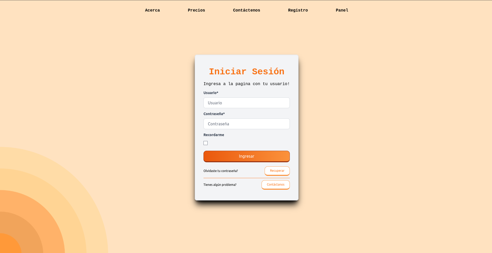
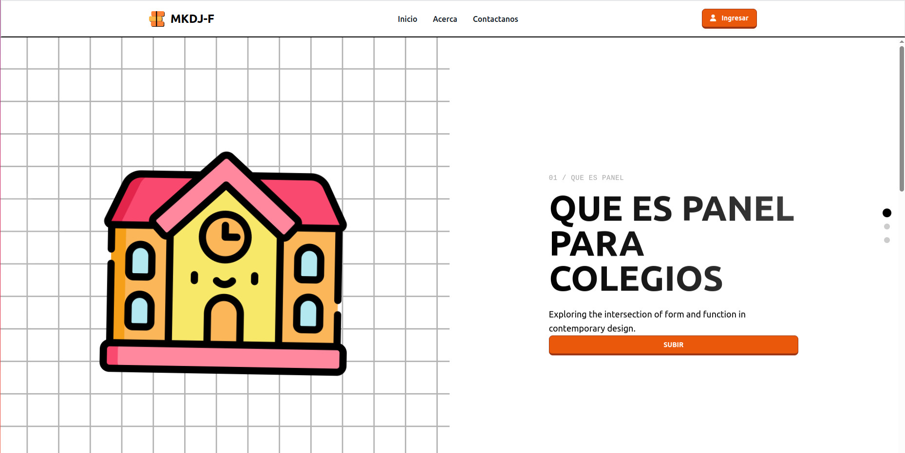

<p align="center">
  
  
</p>


# PANEL-PARA-COLEGIOS

Este proyecto es un sistema de gestión escolar desarrollado en Django, diseñado para facilitar las operaciones administrativas y académicas en colegios.

---

## Requisitos previos

1. **Python**  
   Asegúrate de tener Python instalado. Recomendamos usar la última versión estable.  

2. **Virtualenv**  
   Necesitarás un entorno virtual para gestionar las dependencias del proyecto. Instálalo con:  
   ```bash
   pip install virtualenv
   ```  

3. **Node.js y npm**  
   Este proyecto utiliza Tailwind CSS, que requiere Node.js. Descarga e instala Node.js desde su [página oficial](https://nodejs.org/en/download).  

---

## Instalación y configuración

### 1. Crear un entorno virtual  
Crea un entorno virtual para aislar las dependencias:  
```bash
virtualenv env
```

### 2. Activar el entorno virtual  
En Windows:  
```bash
env\Scripts\activate
```
En Linux/Mac:  
```bash
source env/bin/activate
```

### 3. Instalar dependencias  
Ejecuta el siguiente comando para instalar las dependencias necesarias:  
```bash
pip install -r requirements.txt
```

#### Problema común: Error al instalar dependencias  
Si al instalar las dependencias obtienes un error como:  
```plaintext
error: subprocess-exited-with-error

× Getting requirements to build wheel did not run successfully.
│ exit code: 1
╰─> See above for output.
```
Este error ocurre debido a la falta de herramientas de compilación (como un compilador de C++). Puedes solucionarlo siguiendo [este video](https://youtu.be/wTv8rNobJsw?si=6nO7UaryScIcNIo9).  

### 4. Instalar Tailwind CSS  
Ejecuta:  
```bash
python manage.py tailwind install
```

#### Problema común: Error relacionado con Node.js  
Si ves un error como:  
```plaintext
CommandError: 
It looks like node.js and/or npm is not installed or cannot be found.
```
Asegúrate de que Node.js y npm están instalados correctamente. Si el problema persiste, define la ruta de `npm` en `.env` de la siguiente manera:

Es posible que el archivo .env aún no exista. Puedes crearlo tú mismo en la carpeta raíz del proyecto, junto a archivos y carpetas como:

```
|- colegio/
|- Documentation/
|- mails templates/
|- requirements.txt
```

```bash
WHEREISNPM=tu/ruta/de/npm
```

Puedes revisar la ruta de `npm` ejecutando en ubuntu:
```bash
whereis npm
```

---

## Iniciar el proyecto

1. Navega al directorio del proyecto:  
   ```bash
   cd PANEL-PARA-COLEGIOS/colegio
   ```

2. Inicia el servidor Django:  
   ```bash
   python manage.py runserver
   ```

3. Inicia Tailwind en modo desarrollo:  
   ```bash
   python manage.py tailwind start
   ```

---

## Migraciones y base de datos

1. **Realizar migraciones**  
   ```bash
   python manage.py makemigrations users information admis teachers managers guardians students
   ```

2. **Crear la base de datos**  
   ```bash
   python manage.py migrate
   ```

3. **Crear un usuario administrador**  
   ```bash
   python manage.py createsuperuser
   ```

> **Nota:** Asegúrate de documentar todos los cambios realizados en las migraciones y bases de datos para evitar pérdida de información.

---

## Funcionalidades del sistema

### Vista de Login  
<p align="center">
  
</p>

### Vista de Panel 
<p align="center">
  
</p>

---

## Notas importantes

- **Documentación de cambios:**  
  Es fundamental documentar cualquier cambio realizado en el código o la base de datos.  

- **Precaución:**  
  Manipular las migraciones o realizar cambios incorrectos en el código puede provocar la pérdida de datos.  

---

**¡Gracias por contribuir al proyecto!**  
Un buen código siempre viene acompañado de una buena documentación.